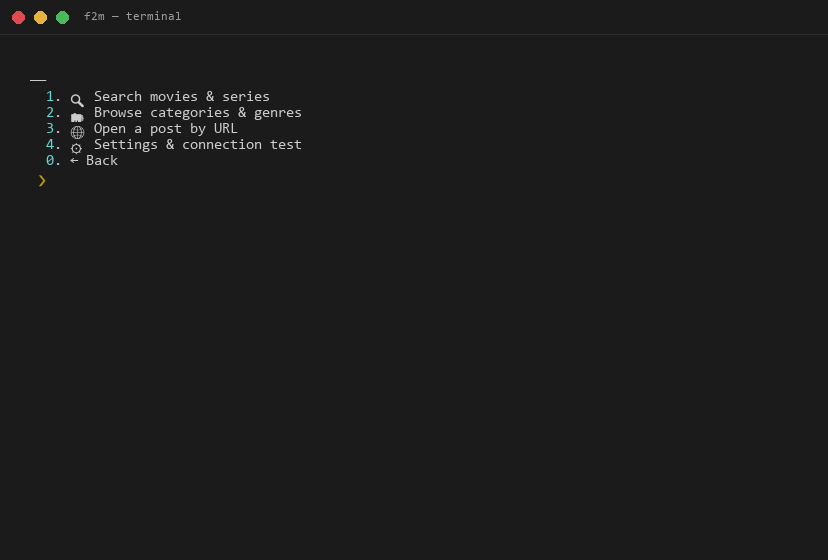
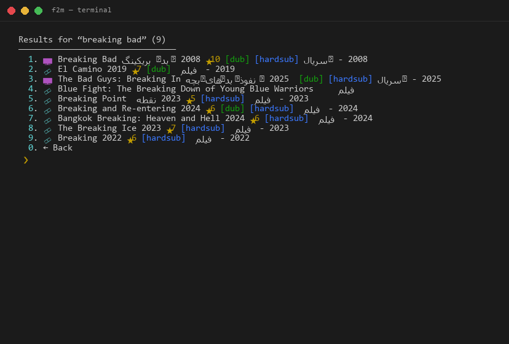
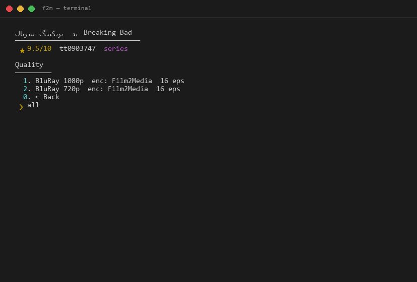

# ⚡ f2m — کلاینت ترمینال فیلم‌تو‌مدیا

جست‌وجو، دانلود و پخش مستقیم فیلم و سریال از فیلم‌تو‌مدیا، داخل ترمینال.

> 🇬🇧 English version: [README.md](README.md)

---

## 📸 تصاویر





---

## ✨ امکانات

- 🔍 **جست‌وجوی سریع** — جست‌وجو با عنوان فارسی یا انگلیسی، همراه امتیاز IMDb و نشان دوبله/زیرنویس
- 🗂 **مرور دسته‌بندی‌ها** — فیلم‌ها، سریال‌ها، ژانرها و لیست ۲۵۰ فیلم/سریال برتر
- ⬇ **دانلود** — دانلود چند-اتصاله با aria2c (در نبودش: curl)
- 🤖 **نصب خودکار aria2c** — اگه aria2c نصب نباشه، خودکار نصبش می‌کنه (لینوکس: پکیج‌منیجر، ویندوز: دانلود باینری رسمی کنار برنامه)
- ▶ **پخش مستقیم** — بدون دانلود، مستقیم در mpv، VLC یا PotPlayer پخش کنید
- 🌐 **به‌روزرسانی خودکار دامنه** — وقتی دامنه‌ی سایت عوض شه، خودکار تشخیص داده و به‌روز می‌شه
- 🧩 **تک‌فایل** — فقط پایتون ۳.۸ به بالا، بدون هیچ وابستگی

---

## 📦 نصب

### گزینه‌ی A — فایل اجرایی آماده (بدون نیاز به پایتون)

فایل `f2m-windows-x64.exe` یا `f2m-linux-x64` را از صفحه‌ی
[**Releases**](https://github.com/lombalo/film2media-cli/releases) دانلود و اجرا کنید.

### گزینه‌ی B — اجرا از سورس

نیازمند پایتون ۳.۸ به بالا:

```bash
python f2m.py
```

پیشنهادی (اختیاری):

- **aria2c** — دانلود سریع
- **mpv** یا **VLC** — پخش مستقیم

---

## 🚀 استفاده

بدون آرگومان اجرا کنید تا منوی تعاملی باز شود:

```
f2m
```

یا از دستورات استفاده کنید:

| دستور | توضیح |
|---|---|
| `f2m search "breaking bad"` | جست‌وجو |
| `f2m categories` | مرور دسته‌بندی‌ها |
| `f2m url <post-url>` | باز کردن مستقیم صفحه‌ی یک فیلم |
| `f2m test` | تست اتصال |
| `f2m config` | نمایش تنظیمات |

داخل منوها می‌توانید مثل `1`، بازه‌ای مثل `1,3,5-8` یا `all` انتخاب کنید.

---

## ⚙️ تنظیمات

تنظیمات در مسیرهای استاندارد کاربری ذخیره می‌شوند (سازگار با استاندارد XDG):
- **لینوکس / مک**: `~/.config/f2m/config.ini` (یا `$XDG_CONFIG_HOME/f2m/config.ini`)
- **ویندوز**: `%APPDATA%\f2m\config.ini`
- **حالت پرتابل**: اگر فایل `./f2m.conf` در پوشه‌ی جاری باشد، اولویت پیدا می‌کند.
- **مهاجرت نسخه‌های قبل**: اگر قبلاً از فایل `f2m.conf` کنار فایل اجرایی استفاده می‌کردید، در اولین اجرا به صورت خودکار و امن به مسیر جدید منتقل می‌شود.

**مشاهده‌ی تنظیمات:**
```bash
f2m config
```

**ویرایش یک تنظیم:**
```bash
f2m config set <key> <value>
# مثال: تغییر دامنه‌ی سایت
f2m config set base_url https://www.new-domain.tld
# مثال: تنظیم پروکسی
f2m config set proxy http://127.0.0.1:8080
```

کلیدهای پشتیبانی‌شده:

| کلید | توضیح |
|---|---|
| `base_url` | آدرس دامنه‌ی اصلی سایت |
| `mirrors` | دامنه‌های جایگزین (جداشده با کاما) |
| `proxy` | پروکسی برای دریافت و دانلود (مثل `http://127.0.0.1:8080`، خالی = غیرفعال) |
| `player` | پخش‌کننده‌ی ترجیحی: `auto` / `mpv` / `vlc` / `potplayer` |
| `download_dir` | پوشه‌ی ذخیره‌سازی دانلودها |
| `search_sort` | نحوه مرتب‌سازی جستجوی سریع |
| `user_agent` | رشته‌ی User-Agent مرورگر |

**تنظیم از طریق متغیرهای محیطی (Environment Variables):**
می‌توانید هر تنظیمی را موقتاً بدون تغییر فایل بازنویسی کنید:
`F2M_BASE_URL`، `F2M_MIRRORS`، `F2M_PROXY`، `F2M_PLAYER`، `F2M_DOWNLOAD_DIR`، `F2M_SEARCH_SORT`، `F2M_USER_AGENT`، یا آدرس فایل سفارشی با `F2M_CONFIG`.

اولویت اعمال: `متغیرهای محیطی > فایل محلی f2m.conf > تنظیمات کاربری XDG > پیش‌فرض‌ها`.

---

## 🛠 توسعه و تست

راه‌اندازی محیط توسعه و اجرای آزمون‌های خودکار:

```bash
# ساخت محیط مجازی
python3 -m venv .venv
source .venv/bin/activate

# نصب وابستگی‌های توسعه
pip install -e ".[dev]"

# اجرای آزمون‌های خودکار آفلاین
pytest
```

---

## 🛠 رفع اشکال

- **چیزی پیدا نشد** → دستور `f2m test` را اجرا کنید
- **اتصال برقرار نشد** → ممکن است دامنه فیلتر شده باشد؛ پروکسی تنظیم کنید یا `base_url` جدید بدهید
- **پخش‌کننده پیدا نشد** → mpv یا VLC نصب کنید یا لینک‌ها را دستی کپی کنید

---

## ⚠️ سلب مسئولیت

این ابزار فقط لینک‌های عمومی را فهرست می‌کند و برای استفاده‌ی شخصی ارائه شده است.
مسئولیت رعایت قوانین محلی بر عهده‌ی کاربر است.

---

## 📄 مجوز

MIT — see [LICENSE](LICENSE)
